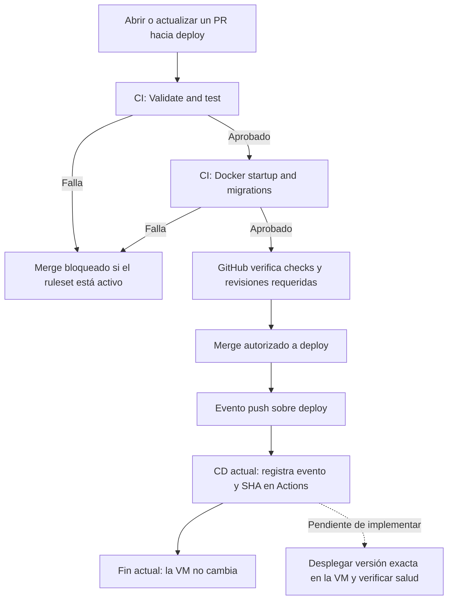

# CI y CD de SCORPIO

* CI: Validacion de esquemas de Prisma, instalacion de dependencias, y despliegue de contenedores Docker para pruebas de arranque y migraciones.
* CD: Registro de evento y SHA candidato al actualizar `deploy`. Pendiente de implementar despliegue real en la VM y verificación de salud.

## Responsabilidades

| Componente | Responsabilidad | Dónde corre |
| --- | --- | --- |
| [ci.yml](../.github/workflows/ci.yml) | Validar schema, compilar, probar y verificar el arranque Docker | Runners temporales `ubuntu-latest` de GitHub |
| Ruleset de `deploy` | Impedir merges sin PR y sin los checks requeridos | Configuración del repositorio en GitHub |
| [cd.yml](../.github/workflows/cd.yml) | Registrar el evento y SHA candidato al actualizar `deploy` | Runner temporal `ubuntu-latest` de GitHub |
| Despliegue real | Actualizar el backend y verificar su salud | `PENDIENTE` de implementar y coordinar con el administrador |

## Flujo hacia deploy

El flujo protegido depende de configurar el ruleset. Los YAML no crean esa regla. CD no consulta automáticamente el resultado de CI: recibe el evento `push`. Un push directo permitido o un bypass también lo activaría.

## CI: cuándo se ejecuta

- En los eventos predeterminados de `pull_request`: apertura, actualización de commits y reapertura, sin filtro de rama destino. Incluye PRs hacia `deploy`.
- En pushes a `development`.
- Mediante `workflow_dispatch` para ejecución manual.

Actualmente no hay trigger de CI por push a `deploy`; la validación normal ocurre en el PR antes del merge. Tampoco se ha configurado `merge_group`: si se adopta una merge queue, hay que agregar ese evento.

### Job 1: Validate and test

Se ejecuta con Node.js `22.12.0`, alineado con el Dockerfile, y un límite de 15 minutos.

| Paso | Qué verifica |
| --- | --- |
| Checkout | Obtiene el código correspondiente a la ejecución |
| `npm ci` | Instala las versiones del lockfile; usa caché de npm |
| `npx prisma validate` | Comprueba la validez del schema Prisma |
| `npx prisma generate` | Genera el cliente Prisma necesario para compilar |
| `npm run build` | Compila la API y verifica tipos TypeScript |
| `npm run build:seed` | Compila el seed; no lo ejecuta |
| `npm test` | Ejecuta las pruebas unitarias en `tests/*.test.cjs` |

La `DATABASE_URL` de este job es ficticia: estos pasos no necesitan conectarse a PostgreSQL. Los tests actuales simulan las dependencias y verifican el comportamiento de los jobs de satélites.

### Job 2: Docker startup and migrations

Solo comienza si el primer job pasa (`needs: validate`). Tiene un límite de 20 minutos y usa [docker-compose.ci.yml](../docker-compose.ci.yml).

1. Construye la imagen usando el Dockerfile real del backend.
2. Levanta PostgreSQL con almacenamiento temporal y credenciales exclusivas de prueba.
3. Arranca la API, cuyo entrypoint ejecuta `prisma migrate deploy` sobre esa base vacía.
4. Espera hasta 180 segundos a que los contenedores estén saludables.
5. Comprueba `/health` y `/api/health` desde el puerto publicado: exige éxito HTTP y JSON con `status: "ok"`.
6. Ejecuta `prisma migrate status` dentro del contenedor de la API.
7. Si falla, imprime estado y últimos logs. La limpieza está configurada con `if: always()` para retirar los recursos temporales al finalizar.

No se usan la base productiva, sus volúmenes, la VPN, la VM ni secretos de producción. No se llama a CelesTrak. El puerto del host se asigna automáticamente. La imagen se construye para la prueba, pero no se publica en un registro ni se transfiere a CD.

Estos checks prueban el arranque y las migraciones desde una base vacía. No garantizan que todas las rutas funcionen ni que una migración sea compatible con datos productivos existentes.

### Resultado de CI

Un resultado exitoso significa que pasaron las comprobaciones anteriores. Un error de comando detiene los pasos normales del job y lo marca como fallido. Las ejecuciones anteriores del mismo workflow y referencia se cancelan al llegar otra ejecución (`cancel-in-progress: true`).

Para reproducir los checks localmente, consultar [Test CI workflow](DEVELOPMENT.md#test-ci-workflow). Ejecutar comandos localmente no reproduce los triggers ni los permisos de GitHub Actions.

## Reglas de merge en GitHub

En Settings, crear o actualizar el ruleset dirigido a `deploy`:

- **Enforcement status: Active**.
- **Require a pull request before merging**.
- **Require status checks to pass**, seleccionando `Validate and test` y `Docker startup and migrations` tal como aparecen en GitHub.
- **Require branches to be up to date before merging**.
- **Required approvals** según el equipo: `1` requiere revisión de otra persona; `0` exige PR sin aprobación humana obligatoria.
- Mantener **Restrict deletions** y **Block force pushes** si esa es la política acordada, y limitar excepciones de bypass.

`Require code quality results` corresponde a otra funcionalidad de GitHub y no reemplaza los checks de nuestro CI. No se requiere `Require deployments to succeed` para este flujo, porque el despliegue previsto ocurre después del merge.

La activación real del ruleset se comprueba en GitHub; su existencia no se puede confirmar solo leyendo este repositorio.

## CD: comportamiento actual

- Un push a `deploy`, incluido un merge, dispara `Scorpio CD`.
- Permite ejecución manual. El job solo corre si `github.ref` es `refs/heads/deploy`; en otra rama se omite. Para usar el botón manual, el workflow debe existir en la rama predeterminada.
- El único job, `Deployment trigger only`, registra `github.event_name` y `github.sha` en el resumen de Actions.
- No hace checkout, SSH, `git pull`, build, publicación de imagen, migraciones ni cambios de contenedores en la VM.
- Tiene permisos `contents: read`, límite de 5 minutos y un grupo de concurrencia compartido. `cancel-in-progress: false` evita cancelar la ejecución activa; no debe interpretarse como una cola durable que garantiza desplegar cada commit.

**CD verde significa que se registró el candidato, no que se desplegó ni que se verificó CI.** No hay actualmente un environment `production` ni una aprobación de despliegue configurada en el YAML.

## Qué falta para un CD real

1. Acordar con el administrador cómo el runner accederá a la red privada: WireGuard y SSH, o un runner propio con acceso autorizado.
2. Definir identidad de despliegue, permisos, rutas de la VM y almacenamiento de credenciales.
3. Implementar despliegue del SHA exacto o de una imagen identificada por ese SHA. Un `git pull` sin fijar versión puede traer cambios posteriores al candidato.
4. Verificar explícitamente la versión aprobada si se permiten pushes directos o bypass del ruleset.
5. Ejecutar healthchecks posteriores, guardar logs y definir el procedimiento de recuperación. Volver a una imagen anterior no revierte migraciones de la base.
6. Si se requiere aprobación adicional antes de modificar producción, configurar un environment y sus revisores, y asociarlo al job de despliegue.

Hasta implementar estos pasos, los merges a `deploy` no actualizan por sí solos la VM mediante este workflow.
